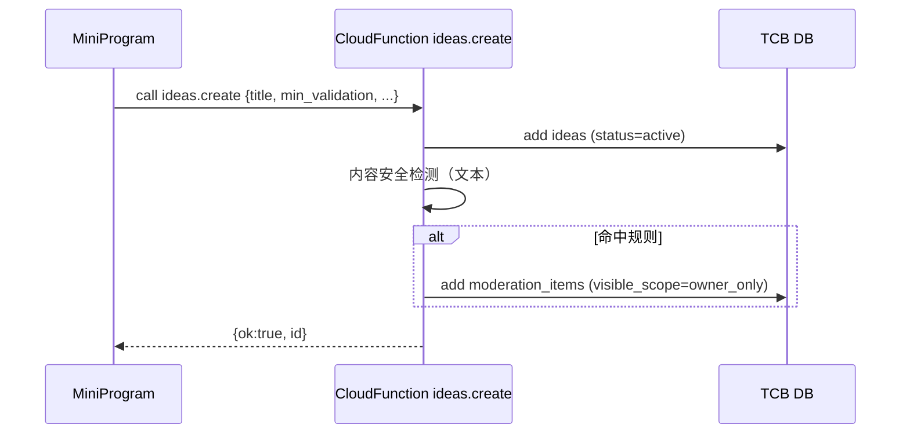

# Architecture — 微信小程序版（MVP）

> 说明：本版架构**专门针对微信小程序**实现，优先使用**微信/腾讯云原生能力**（云开发 TCB：云函数、云数据库、云存储、内容安全、订阅消息）。满足约束：MVP ≤ 6 个月、预算 ≤ ¥1000、短期北极星 = 日活发帖量（DAU Post）。

---

## 1) 系统边界与模块图（WeChat 原生）

```text
[WeChat Mini Program 前端]
  ├─ 原生小程序 (WXML/WXSS/TS) + miniprogram NPM
  ├─ 状态：Pinia-like 轻量 store 或自实现
  ├─ 数据：wx.cloud.database() + 调用云函数
  ├─ 登录：wx.login → code2Session（获取 openid/unionid）
  ├─ 通知：订阅消息（一次性）/ 服务通知（后期）
  └─ 媒体：wx.chooseImage / wx.cloud.uploadFile → 云存储

[云开发（TCB / CloudBase）]
  ├─ 云函数（Node.js 16+）
  │   ├─ auth.*        登录态校验、资料完善
  │   ├─ ideas.*       点子CRUD、检索、置顶/归档
  │   ├─ comments.*    评论/回复
  │   ├─ teams.*       认领/审批、成员管理
  │   ├─ tasks.*       看板任务
  │   ├─ milestones.*  里程碑提交/审核、作品集入库
  │   ├─ moderation.*  规则命中、待审队列、人工复核
  │   └─ notify.*      订阅消息推送、站内通知
  ├─ 云数据库（TCB 文档型 DB）
  │   └─ 集合（collections）：users、ideas、comments、teams、claims、
  │      team_members、tasks、milestones、portfolios、moderation_items、
  │      reports、bans、notifications、audit_logs
  ├─ 云存储（COS 托管于云开发）
  │   └─ 图片/GIF/截图（防盗链、鉴权下载）
  ├─ 内容安全（腾讯云 Content Security）
  │   └─ 文本/图片鉴黄涉政等；审核策略与分级
  └─ 日志与监控：云函数日志、CLS（可选），性能(小程序·性能监控)

[外部（可选/后期）]
  ├─ 企业微信/微信群机器人（通知联动）
  └─ 自建检索（Meilisearch/Typesense）— MVP 阶段以 TCB 聚合 + 索引代替
```

**部署与环境**：`env-dev`、`env-prod` 两套云环境；以小程序 IDE 上传、云函数一键部署。按量计费，MVP 阶段一般可控制在**¥0–¥100/月**（不含大规模图片流量）。

---

## 2) 关键数据模型（TCB 集合）
> TCB 为文档数据库（JSON），以下为核心集合字段建议（节选）。索引：为高频查询字段创建复合索引（如 `author_id+created_at`、`stage+updated_at`）。

### 2.1 `users`
```json
{
  "_id": "auto",
  "openid": "wx_xxx",          // 鉴权主键
  "unionid": "u_xxx",          // 可为空
  "nickname": "string",
  "avatar_url": "string",
  "city": "string",
  "bio": "string",
  "skills": ["design", "dev"],
  "visibility": "public|members",
  "counters": {"ideas": 0, "milestones": 0},
  "created_at": 1710000000,
  "updated_at": 1710000000
}
```

### 2.2 `ideas`
```json
{
  "_id": "auto",
  "author_id": "openid",
  "title": "string",
  "problem": "text",
  "solution": "text",
  "min_validation": "text",      // 必填
  "stage": "inspiration|initiated|validating|demo",
  "required_roles": [{"role":"dev","max":2}],
  "tags": ["AI","工具"],
  "status": "active|archived|shadow_ban",
  "stats": {"comments":0, "milestones":0, "follows":0},
  "created_at": 1710000000,
  "updated_at": 1710000000
}
```

### 2.3 `comments`
```json
{
  "_id":"auto", "idea_id":"id", "author_id":"openid",
  "parent_id":"id|null", "body":"text",
  "created_at":1710000000
}
```

### 2.4 组队与认领：`teams`、`team_members`、`claims`
```json
// claims（认领申请）
{"_id":"auto","idea_id":"id","role":"product|design|dev|ops|bd|other",
 "applicant_id":"openid","message":"string(<=280)",
 "status":"pending|approved|rejected","created_at":...,"decided_at":...}

// teams（一个点子可 0..1 活跃团队）
{"_id":"auto","idea_id":"id","owner_id":"openid",
 "created_at":...,"updated_at":...}

// team_members
{"_id":"auto","team_id":"id","user_id":"openid",
 "role":"dev","joined_at":...,"left_at":null}
```

### 2.5 看板与里程碑：`tasks`、`milestones`、`portfolios`
```json
// tasks
{"_id":"auto","team_id":"id","title":"string","description":"text",
 "assignee_id":"openid|null","status":"todo|doing|done",
 "due_at":null,"attachments":[{"type":"image","url":"cos://..."}],
 "order_no": 10, "created_at":..., "updated_at":...}

// milestones
{"_id":"auto","idea_id":"id","team_id":"id",
 "title":"string","evidence":[{"type":"link|image|gif","url":"..."}],
 "status":"submitted|approved|declined","created_by":"openid",
 "reviewed_by":"openid|null","created_at":...,"reviewed_at":...}

// portfolios（通过后入库）
{"_id":"auto","user_id":"openid","milestone_id":"id",
 "summary":"string(<=160)","created_at":...}
```

### 2.6 审核与风控：`moderation_items`、`reports`、`bans`
```json
// moderation_items
{"_id":"auto","subject_type":"idea|comment|milestone|task",
 "subject_id":"id","risk_reason":"hit:politics|porn|ad|link",
 "status":"pending|approved|rejected","visible_scope":"owner_only|public",
 "created_at":...,"reviewed_at":...,"reviewed_by":"openid|null"}

// reports（用户举报）
{"_id":"auto","subject_type":"idea|comment|milestone|user",
 "subject_id":"id","reporter_id":"openid","category":"spam|abuse|illegal|porn|plagiarism|other",
 "detail":"text","status":"open|resolved|rejected","created_at":...,"resolved_at":...}

// bans
{"_id":"auto","user_id":"openid","device_id":"hash|null","ip_hash":"hash|null",
 "level":"temp|permanent","start_at":...,"end_at":...}
```

### 2.7 通知与审计：`notifications`、`audit_logs`
```json
{"_id":"auto","user_id":"openid","type":"claim.approved|milestone.approved|comment.reply|...",
 "payload":{},"read_at":null,"created_at":...}

{"_id":"auto","actor_id":"openid","action":"approve_claim|ban_user|delete_comment|...",
 "subject_type":"claim|user|comment|...","subject_id":"id","meta":{},"created_at":...}
```

---

## 3) 接口与用例顺序（云函数调用示例）
> 采用 **云函数名称空间**：`ideas.*`、`claims.*`、`milestones.*`；小程序端使用 `wx.cloud.callFunction({ name, data })`。所有写操作校验 `openid` 并做频控。

### 3.1 用例 A：发布点子
**Sequence**

**函数签名**
```ts
// ideas.create
Input: { title, problem, solution, min_validation, tags, stage, required_roles }
Out  : { ok: boolean, id?: string, error?: string }
```

### 3.2 用例 B：认领角色位 → 发起人审批
**Sequence**
```mermaid
sequenceDiagram
  participant MP as MiniProgram (Applicant)
  participant CF1 as claims.create
  participant CF2 as claims.approve
  participant DB as TCB DB
  MP->>CF1: { idea_id, role, message }
  CF1->>DB: add claims(status=pending)
  CF1->>DB: add notifications(to=idea.owner)
  Owner->>CF2: { claim_id }
  CF2->>DB: update claims→approved; add team_members
  CF2->>CF2: push 订阅消息 (可选)
```

### 3.3 用例 C：提交里程碑（含图片）并审核
```mermaid
sequenceDiagram
  participant M as Member
  participant ST as COS(云存储)
  participant CF as milestones.submit
  participant DB as TCB DB
  M->>ST: uploadFile(image/gif)
  M->>CF: { team_id, idea_id, title, evidence:[{type:'image',url:cos://...}] }
  CF->>DB: add milestones(status=submitted)
  CF->>CF: 内容安全(图片/文本)
  Reviewer->>CF: milestones.review {id, approve:true|false}
  CF->>DB: update status; on approve → add portfolios
```

---

## 4) 质量与安全

### 4.1 内容审核 Pipeline（原生 API 优先）
1. **同步规则**：云函数在写入前调用 **腾讯云文本/图片内容安全**；命中→`moderation_items.pending` 且 `visible_scope=owner_only`。
2. **人工复核**：运营小程序/网页（后期）从 `moderation_items` 拉取待审，12h 内处理；通过后公开。
3. **举报**：`reports` 工单化；闭环到删除/禁言/封禁（`bans`）。

### 4.2 频控与滥用
- 通过 **云函数 + Redis-like（TCB 内置计数或自建集合）** 实现 QPS/日用量限制；新号权重降低。
- 自动降权：7 天无推进的点子降低排序权重。

### 4.3 日志与观测
- 使用云函数日志与**CLS**（可选）保存 180 天审计；
- 前端使用 **小程序性能监控**查看首屏、卡顿；关键埋点：`post_publish_success`、`claim_request_submitted`、`milestone_submitted`。

### 4.4 隐私与合规
- 最小化收集，仅存 `openid/unionid`、昵称、头像、城市等；
- 敏感字段（手机号）加密/脱敏；导出与注销流程；
- 访问控制：草稿/待审仅作者与运营可见，团队私有内容仅成员可见。

---

## 5) 约束与技术选型建议（小程序原生）
- **前端**：原生小程序 + TypeScript；UI 组件（自研或 Vant Weapp）；轻 store；表单草稿存 `Storage`。
- **云开发**：
  - 云函数 Node.js 16+；按域 `ideas.* / claims.* / moderation.*` 划分；
  - 数据库：使用集合与复合索引；大查询分页 + 轻缓存（本地 Storage）。
  - 存储：所有媒体走 `cloud://`，启用图片压缩与限宽；
  - 内容安全：文本/图片全量走腾讯云内容安全接口；
  - 通知：订阅消息需用户授权，保留模板 ID 配置（如：认领通过、里程碑通过）。
- **成本控制**：
  - 图片尺寸限制（≤ 2MB，长边 ≤ 1600px）；
  - 列表请求合并（批量 get）；
  - 非核心功能（搜索、复杂报表）延后。

---

## 6) API/函数清单（节选）
```text
ideas.create | ideas.update | ideas.list | ideas.get
comments.create | comments.list
claims.create | claims.approve | claims.reject
teams.ensureForIdea | teamMembers.remove
tasks.create | tasks.update | tasks.reorder
milestones.submit | milestones.review
reports.create | moderation.listPending | moderation.update
notifications.list | notifications.read
```

---

## 7) 环境与发布
- 环境：`dev`、`prod` 两套；数据库集合使用前缀隔离或多环境隔离。
- 发布：小程序 IDE 上传 → 体验版 → 提审 → 上线；云函数灰度发布（按别名）。
- 监控：云函数告警阈值（错误率、超时）、日调用量与费用看板。

> 结论：上面的 Architecture 已**完全按微信小程序方案重构**，并尽量使用微信/腾讯云原生资源（云开发、云数据库、云存储、内容安全、订阅消息）。如需，我可以生成**集合索引建模清单**与**函数目录模板**。

